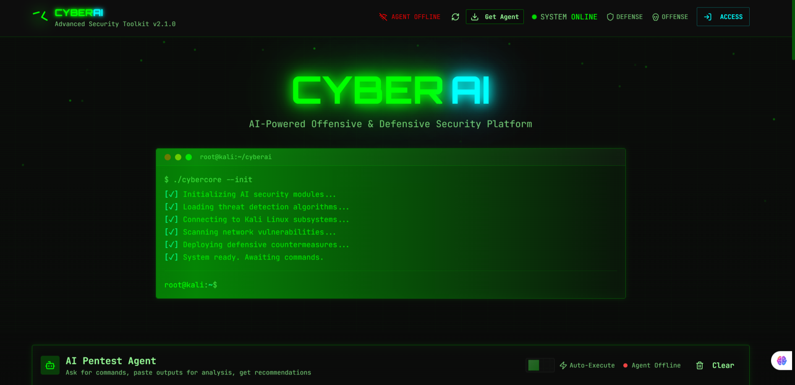

<!-- Banner -->
<p align="center">
  
</p>

<p align="center">
  
  
  
  
</p>

---

## 🔥 **CYBERAI – Advanced Security Toolkit**
A futuristic AI-powered cybersecurity operations panel that combines **defensive systems**, **offensive hacking tools**, **AI pentest automation**, and **real-time analysis**.

<p align="center">
  <         
       
            
           
            
</p>


## 🚀 **Features**
### 🧠 AI Pentest Agent
- Auto-executes commands  
- Analyzes scan output  
- Generates remediation steps  
- Supports Nmap, Hydra, SQLMap, Metasploit, Gobuster & more  

### 🛡️ Defensive Systems
- Fail2ban  
- Snort IDS  
- ClamAV  
- OSSEC  
- Suricata  
- AIDE  
- Rkhunter  
- OpenVAS  

### ⚔️ Offensive Arsenal
- Nmap  
- Hydra  
- Nikto  
- SQLMap  
- Aircrack-ng  
- Metasploit  
- Burp Suite  
- Hashcat  
- John the Ripper  

<p align="center">
       
           
            
</p>


## 🧩 **Tech Stack**
<p align="center">
  
</p>

---

## ⚙️ **Installation**
```bash

git clone https://github.com/HackerB777/CYBER-AI-V2-
cd CYBER-AI-V2-
sudo apt update
sudo apt install -y curl
curl -fsSL https://deb.nodesource.com/setup_20.x | sudo -E bash -
sudo apt install -y nodejs
npm -i
npm run dev

