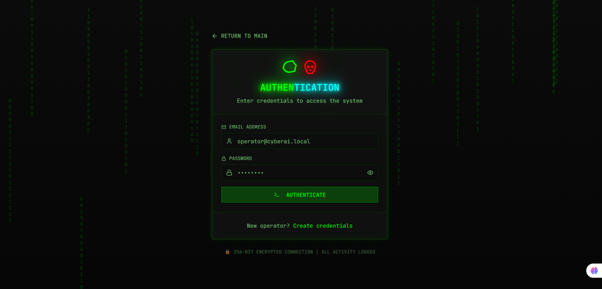
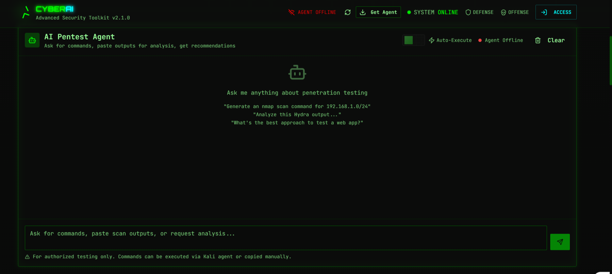
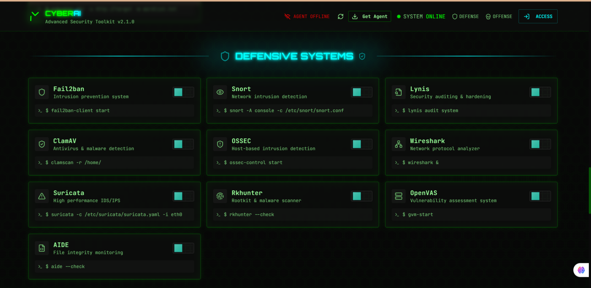
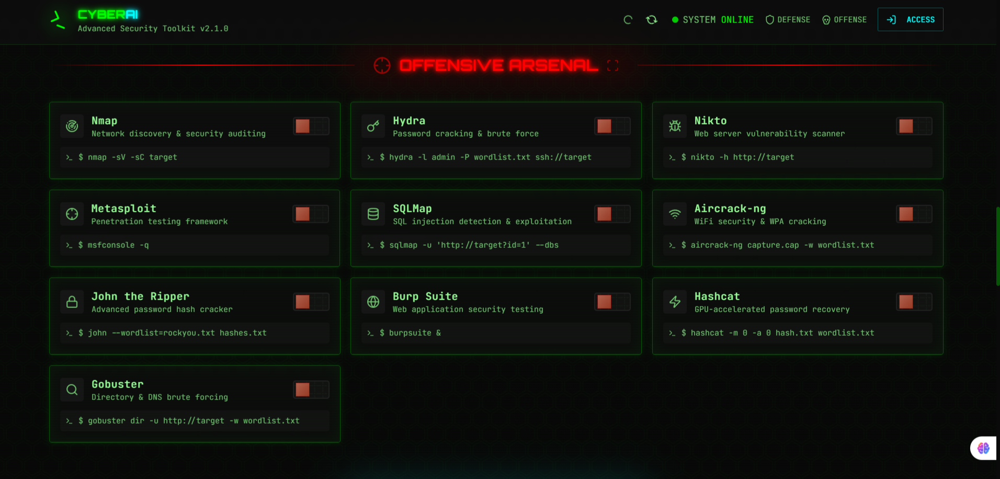
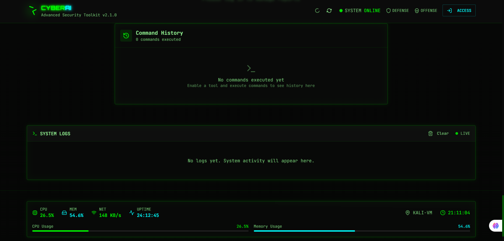

<!-- Animated Header -->
<p align="center">
  
</p>

<p align="center">
  
  
  
  
</p>

---

# 🔥 CYBERAI – Advanced Security Toolkit  
AI-powered offensive & defensive cybersecurity framework with:

- AI Pentest Agent  
- Offensive Hacking Tools  
- Defensive Monitoring Systems  
- Real-time Log Analyzer  
- Automated Vulnerability & Threat Detection  

---

# 📸 Screenshot Slider (Animated Left–Right)

<p align="center">
  <svg width="850" height="420">
    <foreignObject width="100%" height="100%">
      <div xmlns="http://www.w3.org/1999/xhtml">
        <style>
          .slider {
            width: 850px;
            height: 420px;
            overflow: hidden;
            border-radius: 12px;
            border: 2px solid #00ff00;
          }
          .slides {
            display: flex;
            width: 500%;
            animation: slide 18s infinite;
          }
          .slides img {
            width: 850px;
            height: 420px;
            object-fit: cover;
          }
          @keyframes slide {
            0%   { transform: translateX(0%); }
            20%  { transform: translateX(0%); }
            25%  { transform: translateX(-100%); }
            45%  { transform: translateX(-100%); }
            50%  { transform: translateX(-200%); }
            70%  { transform: translateX(-200%); }
            75%  { transform: translateX(-300%); }
            90%  { transform: translateX(-300%); }
            95%  { transform: translateX(-400%); }
            100% { transform: translateX(-400%); }
          }
        </style>

        <div class="slider">
          <div class="slides">
            
            
            
            
            
          </div>
        </div>
      </div>
    </foreignObject>
  </svg>
</p>

---

# ⚙️ Features  
## 🧠 AI Pentest Agent  
- Generates commands  
- Reads and analyzes tool outputs  
- Suggests exploitation paths  
- Detects vulnerabilities automatically  

## 🛡️ Defensive Security Systems  
- Fail2Ban  
- Snort IDS  
- OSSEC  
- Suricata  
- ClamAV  
- AIDE  
- Rkhunter  
- OpenVAS  

## ⚔️ Offensive Toolkit  
- Nmap  
- Hydra  
- Nikto  
- SQLMap  
- Aircrack-ng  
- Metasploit  
- John the Ripper  
- Hashcat  
- Gobuster  
- Burp Suite  

---

# 🧩 Technology Stack
<p align="center">
  
</p>

---

# 📦 Installation  
```bash
git clone https://github.com/YourUsername/YourRepo.git
cd YourRepo
chmod +x cybercore.sh
./cybercore.sh --init
